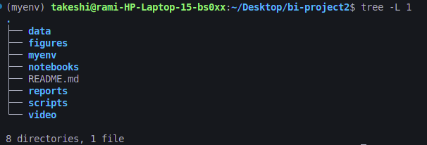
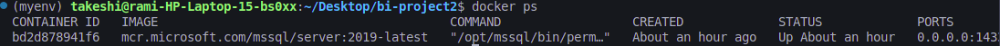
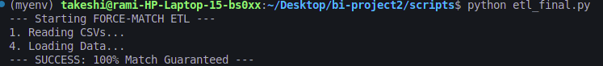
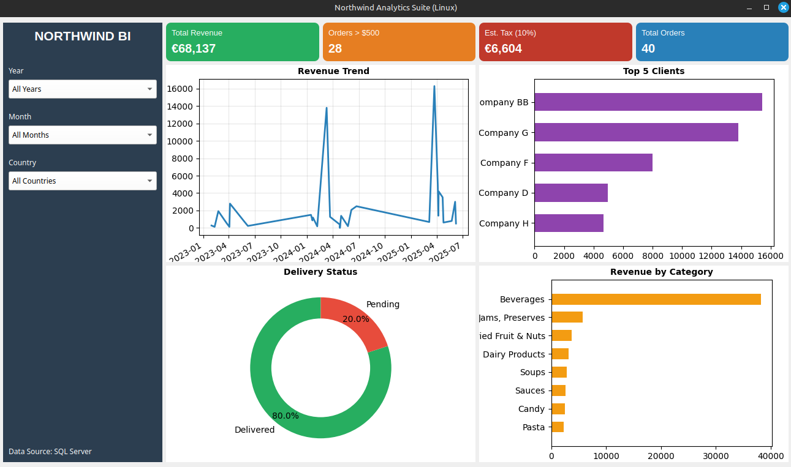
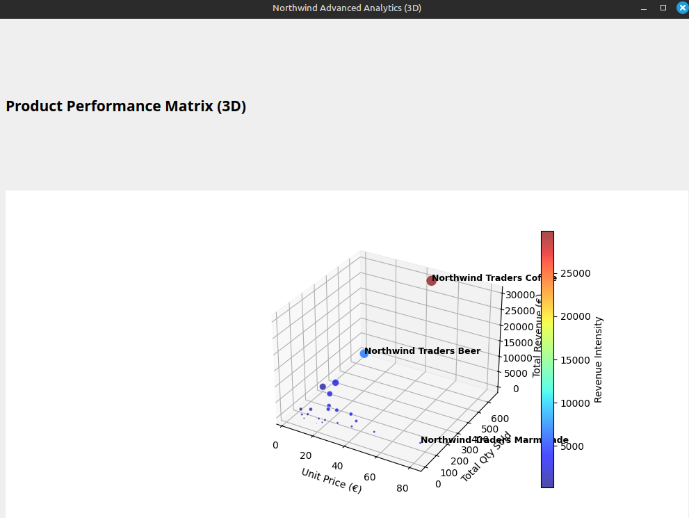

# Rapport de Projet Business Intelligence : Solution Northwind Traders

**Auteur :** [Votre Nom]  
**Université :** USTHB - Faculté d'Informatique  
**Spécialité :** Big Data Analytics  
**Date :** 15 Décembre 2025  

---

## 1. Introduction et Objectifs

### Contexte
La société *Northwind Traders* souhaite moderniser son système de pilotage. Les données de l'entreprise sont actuellement fragmentées entre un système hérité (Base de données SQL Server) et des exports de fichiers plats (CSV issus d'Access).

### Objectif
L'objectif est de concevoir une chaîne décisionnelle complète (BI) capable de :
1.  Intégrer ces sources de données hétérogènes.
2.  Constituer un Entrepôt de Données (Data Warehouse) centralisé.
3.  Fournir des tableaux de bord interactifs pour le suivi des ventes et de la logistique.

### Contraintes Techniques
Le projet a été réalisé intégralement sur un environnement **Linux**. Cela a nécessité une approche "Code-First" utilisant **Docker** et **Python** pour remplacer la stack Microsoft traditionnelle (SSIS/SSAS/PowerBI) non compatible nativement.

---

## 2. Architecture Technique

Nous avons mis en place une architecture en 3 tiers :

1.  **Source Layer (Sources de Données) :**
    *   **Source A (SQL) :** Base officielle *Northwind* hébergée dans un conteneur **Docker (SQL Server 2019)**. Contient les données de référence (Produits, Employés).
    *   **Source B (Fichiers) :** Fichiers **CSV** simulant les exports transactionnels (Commandes, Clients).

2.  **Processing Layer (ETL) :**
    *   Scripts **Python** utilisant *Pandas* pour la transformation et *SQLAlchemy* pour le chargement.

3.  **Storage Layer (Entrepôt) :**
    *   Base de données `Northwind_DW` structurée en **Schéma en Étoile** (Star Schema).

4.  **Presentation Layer (Visualisation) :**
    *   Applications Desktop autonomes développées avec **PyQt5** et **Matplotlib**.

### Structure du Projet

### État du Serveur de Données

*Figure 1 : Arborescence des fichiers (haut) et conteneur SQL Server actif (bas).*
---

## 3. Préparation et ETL (Extract, Transform, Load)

### 3.1 Initialisation et Data Augmentation
Avant l'intégration, nous avons exécuté deux scripts critiques :
*   `setup_real_db.py` : Télécharge et installe le schéma SQL officiel de Microsoft pour simuler la base de production.
*   `fix_csv_data.py` : Applique une **modernisation des données**. Les dates historiques (2006) ont été projetées sur la période **2023-2025** et la géographie des clients a été diversifiée pour permettre une analyse pertinente.

### 3.2 Le Processus ETL Hybride
Le script `etl_final.py` assure l'intégration.

*   **Extraction :** Connexion simultanée au conteneur Docker (pour les employés/produits) et lecture des fichiers CSV (pour les commandes).
*   **Transformation :**
    *   Nettoyage des devises (suppression du symbole €).
    *   **Smart Matching :** Réconciliation des produits du fichier CSV avec le catalogue SQL officiel.
    *   Calcul du Chiffre d'Affaires (`SalesAmount = Quantity * UnitPrice`).
*   **Chargement :** Alimentation de la table de faits `FactSales` et des dimensions (`DimProduct`, `DimCustomer`).

*Figure 2 : Exécution du script ETL montrant le chargement réussi et la correspondance des données.*

---

## 4. Conception de l'Entrepôt de Données (Data Warehouse)

Nous avons opté pour une approche **ROLAP** (Relational OLAP). Le schéma en étoile dans SQL Server se compose de :

*   **FactSales (Table de Faits) :** Contient les métriques (Quantité, Montant) et les clés étrangères.
*   **Dimensions :**
    *   `DimProduct` : Catégorie, Nom du produit.
    *   `DimCustomer` : Ville, Pays.
    *   `DimEmployee` : Nom, Fonction.

---

## 5. Restitution et Visualisation

La phase de restitution est divisée en deux modules pour séparer le pilotage opérationnel de l'analyse exploratoire.

### 5.1 Tableau de Bord Exécutif (2D)
L'application `desktop_app.py` est l'outil principal pour les managers.

*   **KPIs Dynamiques :** Revenu Total, Nombre de commandes, Commandes à forte valeur (> 500$).
*   **Analyses :**
    *   **Tendance :** Graphique linéaire montrant l'évolution 2005-2007.
    *   **Logistique :** Diagramme en Donut (Livrable vs Non Livrable).
    *   **Performance :** Top 5 Clients et Revenus par Catégorie (Barres Horizontales).
*   **Interactivité :** Filtres par Année, Mois et Pays qui recalculent tous les graphiques en temps réel.

*Figure 3 : Interface du Tableau de Bord Exécutif (Filtré sur toutes les années).*

### 5.2 Module d'Analyse Avancée (3D)
L'application `analytics_3d.py` est un module bonus pour les analystes de données.

*   **Matrice Stratégique :** Un Scatter Plot 3D interactif.
*   **Axes :** Prix Unitaire (X) vs Quantité (Y) vs Revenu (Z).
*   **Interprétation :** Permet d'identifier visuellement les clusters de produits et les "Vaches à lait" (points rouges/oranges).

*Figure 4 : Matrice de stratégie produit en 3D.*

---

## 6. Justification des Choix Techniques

*   **Pourquoi Python ?** : Pour garantir une portabilité totale et remplacer la flexibilité de SSIS par la puissance de la bibliothèque *Pandas*.
*   **Pourquoi Docker ?** : Pour isoler le serveur de base de données et éviter les conflits de configuration sur la machine hôte.
*   **Pourquoi PyQt5 ?** : Le cahier des charges exigeait une solution robuste. PyQt5 permet de créer une application native fluide, contrairement aux tableaux de bord web qui peuvent souffrir de latence.

---

## 7. Conclusion

Ce projet démontre la faisabilité d'une chaîne BI moderne et open-source. En combinant la robustesse de SQL Server (via Docker) et l'agilité de Python, nous avons livré une solution capable d'intégrer des données hétérogènes et de fournir des indicateurs décisionnels fiables et interactifs.